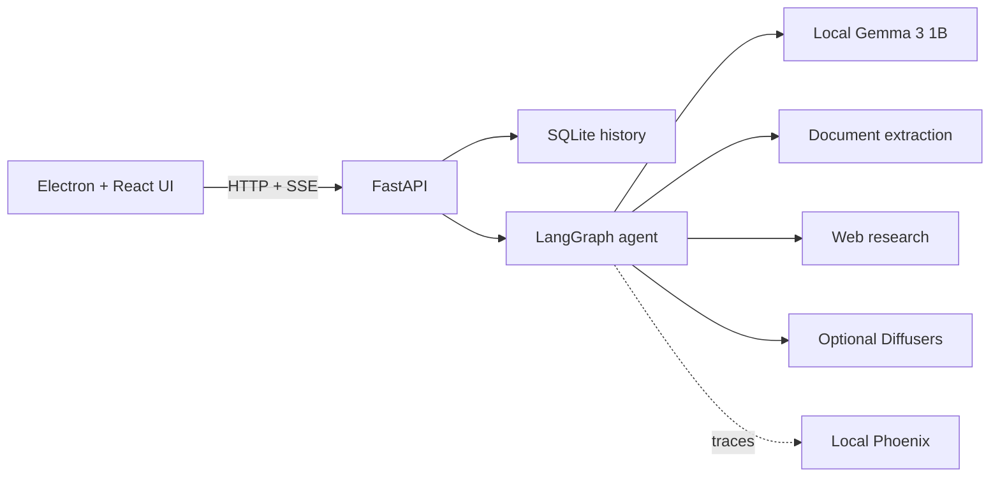

# Gemma Studio

A local-first desktop AI workspace powered by **Gemma 3 1B**, LangGraph, Phoenix, FastAPI, React, and Electron. It supports private chat, code generation, document analysis, cited web research, optional image generation, persistent conversation history, and server-sent response streaming.

The default configuration is deliberately tuned for a CPU laptop. The language model runs locally; only Hugging Face model download and explicit web-research requests use the network.

## CPU requirements

- Windows 10/11, macOS, or Linux
- Python 3.11 or 3.12 (64-bit)
- Node.js 20+
- 8 GB RAM minimum; 16 GB recommended
- Roughly 6 GB free disk for Python packages, model cache, and app data
- A Hugging Face account with the Gemma license accepted

CPU generation is functional but not instant. A typical modern laptop may produce a few tokens per second. Tokens are displayed as soon as the model produces them. `MAX_NEW_TOKENS=1024` permits longer answers; reduce it if lower latency matters more than response length. Image diffusion is disabled by default because it is usually too slow and memory-heavy without a GPU.

## Quick start on Windows

1. Install Python 3.11 and Node.js 20 or newer.
2. Sign in to Hugging Face, open [`google/gemma-3-1b-it`](https://huggingface.co/google/gemma-3-1b-it), and accept Google's Gemma license. Create a read token from that **same account**; access can take a few minutes to propagate.
3. In PowerShell:

```powershell
.\scripts\setup.ps1
```

4. Put the token in `.env`:

```dotenv
HF_TOKEN=hf_your_read_token
```

5. Start the backend in one terminal:

```powershell
.\scripts\start-backend.ps1
```

6. Start the Electron UI in another:

```powershell
cd frontend
npm run dev
```

The first prompt triggers the model download. The API docs are at [http://127.0.0.1:8765/docs](http://127.0.0.1:8765/docs).

If Hugging Face returns `403 Cannot access gated repo`, the token is valid but its account has not accepted the Gemma license. Accept access on the model page, restart the backend, and retry. Creating a different token without accepting the license will not resolve it.

## CPU tuning

The defaults in `.env.example` are safe for CPU inference:

```dotenv
MODEL_ID=google/gemma-3-1b-it
MODEL_DEVICE=cpu
MODEL_DTYPE=float32
MODEL_QUANTIZATION=none
MAX_NEW_TOKENS=1024
MODEL_CONTEXT_MESSAGES=12
CPU_THREADS=0
```

`CPU_THREADS=0` lets PyTorch choose. On a machine that becomes sluggish, set it to half the logical CPU count. Reducing `MAX_NEW_TOKENS` to 256 improves response time. `DOCUMENT_MAX_CHARS=24000` limits CPU prompt-prefill time for uploads; increasing it includes more source text but delays the first token. Do not enable bitsandbytes quantization for the default Windows CPU setup.

## Capabilities

- **Chat and code:** local Gemma inference with production-oriented prompting.
- **Documents:** PDF, DOCX, text, Markdown, source code, JSON, and CSV up to 25 MB. Extracted text is capped before prompting to keep CPU inference manageable.
- **Research:** API-key-free pipeline using DDGS for discovery, HTTPX for concurrent retrieval, and BeautifulSoup for local content extraction. Research is the only agent mode that deliberately accesses the public web.
- **Images:** optional local Diffusers pipeline. Install with `pip install -e ".[image]"` and set `IMAGE_MODEL_ID`; a GPU is strongly recommended.
- **Observability:** traces FastAPI requests, LangGraph/LangChain nodes, HTTP calls, tools, and local Gemma generation to a local Phoenix collector. Start it with `scripts\start-phoenix.ps1`; the application continues normally if it is absent.

## Architecture



Electron uses context isolation, sandboxing, no Node integration in the renderer, and external-browser handling for links. Uploaded files are type-allowlisted and size-limited. For multi-user or internet-facing deployment, add authentication, per-user storage isolation, SSRF egress controls, malware scanning, rate limits, and a production database before exposing the API.

## Development checks

```powershell
.\.venv\Scripts\python.exe -m ruff check backend tests
.\.venv\Scripts\python.exe -m pytest
cd frontend
npm run build
```
